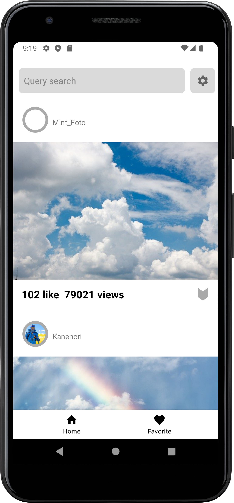

# ImageFind

### О проекте

Функционал:
 
* Навигация приложения **(Done)**
* загрузка изображений с сайта *https://pixabay.com/*, используя открытое [API](https://pixabay.com/api/docs/) **(Done)**;
* отображение, загруженного списка изображений, в recyclerView **(Done)**;
* добавление информации изображении в базу данных (избранное) **(Done)**;
* отображение списка избранных **(Done)**;
* отображение полной информации изображения;
* пагинация **(Done)**.

---

Стэк: Dagger2, RxJava, Retrofit. 

Pattern: MVVM.

Architecture: clean architecture.

---

### Актуальный скриншот приложения

