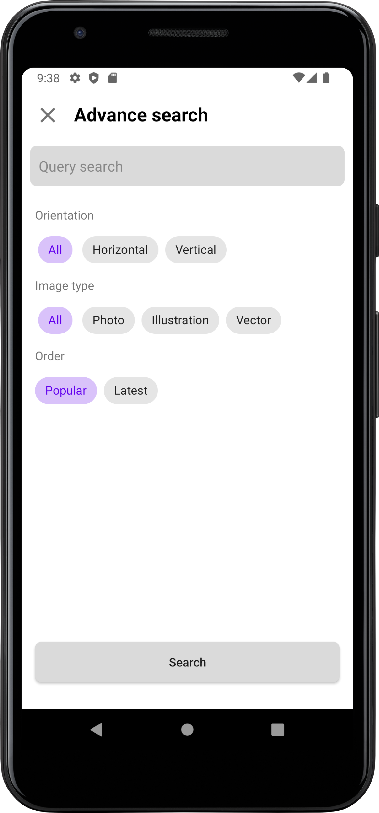
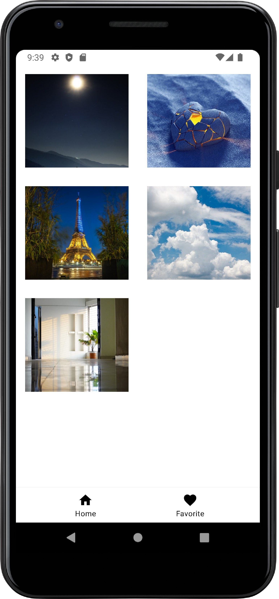

# ImageFind

### О проекте

Функционал:
 
* Навигация приложения;
* поиск изображений с сайта *https://pixabay.com/*, используя открытое [API](https://pixabay.com/api/docs/);
* добавление, отображение избарнных картинкок;
* расширенный поиск;
* пагинация.

---

Стэк: Dagger2, RxJava, Retrofit. 

Pattern: MVVM.

Architecture style: clean architecture.

---

### Актуальный скриншоты приложения

&nbsp;

&nbsp;

